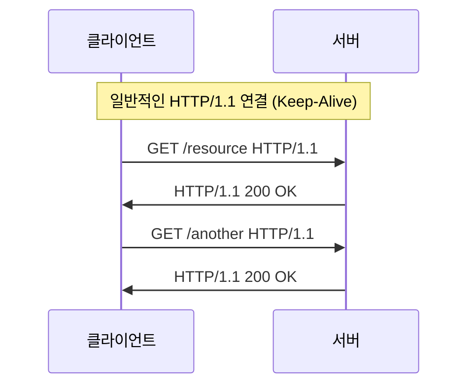
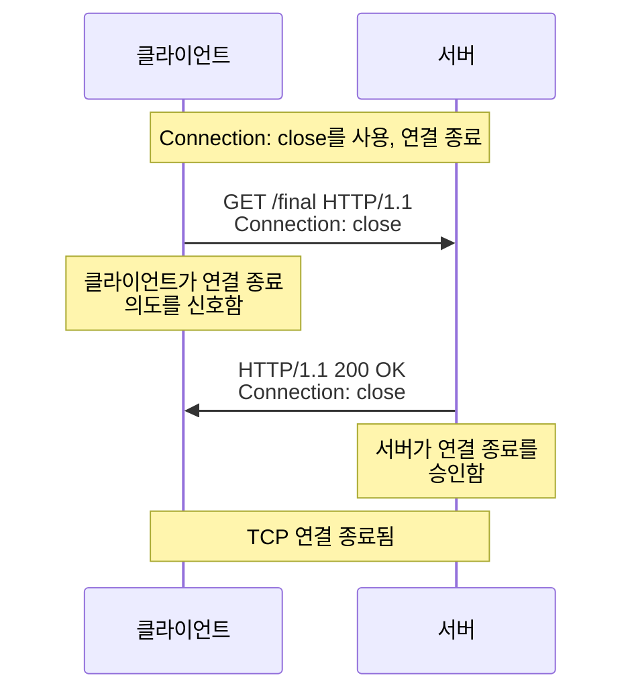
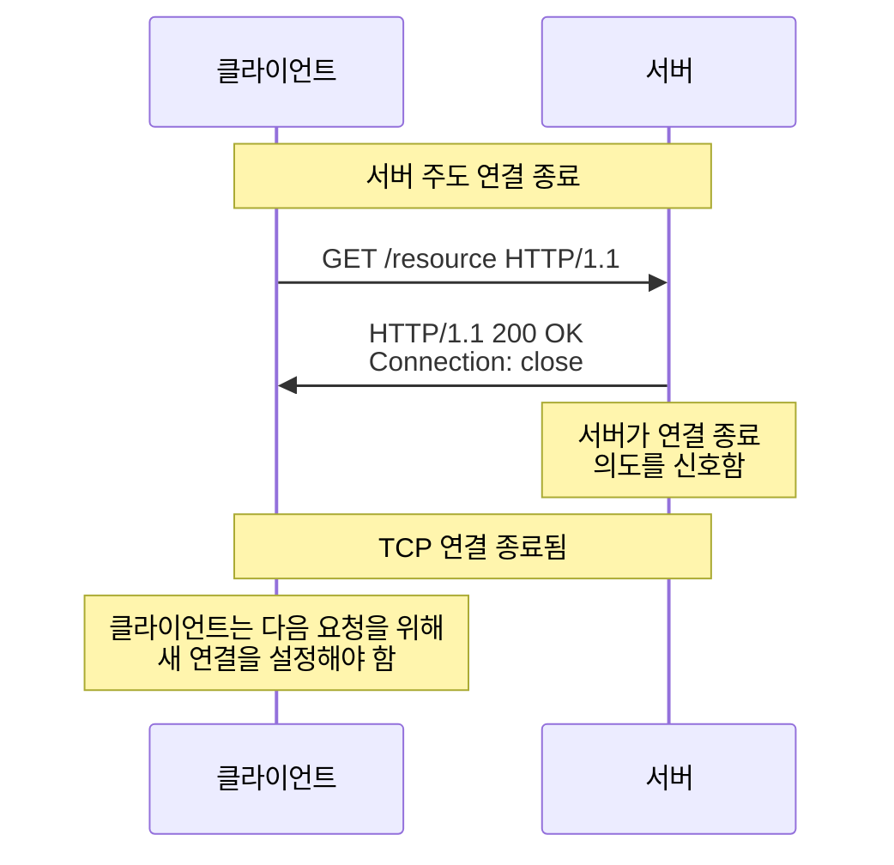

# HTTP란?

Hypertext Transfer Protocol(HTTP)는 월드 와이드 웹에서 데이터 통신의 기반입니다.
클라이언트와 서버 간의 정보 교환을 가능하게 돕습니다. 
웹 애플리케이션이 발전함에 따라 초기 HTTP 버전의 한계가 명확히 나타났습니다.
이는 네트워크 리소스의 비효율적인 사용과 Head-of-Line(HOL) 블로킹 문제입니다.

## HTTP HOL Blocking

Head-of-Line 블로킹에서 모든 요청들은 이전 요청의 완료를 기다려야 합니다.
이는 불필요한 지연과 사용자 경험 저하를 초래합니다. 
웹 페이지가 복잡해지고 단일 페이지를 렌더링하기 위해 수십 개의 리소스가 필요해짐에 따라 두드러졌습니다.

`HTTP/1.0`에서는 각 요청마다 새로운 TCP 연결을 설정해야 했고, 이로 인해 서버 부하 증가와 인터넷 혼잡이 발생했습니다. 
인라인 이미지와 관련 데이터를 포함하는 웹페이지에서는 짧은 시간 내에 동일한 서버에 여러 요청을 해야 하는 경우가 많았습니다.

`HTTP/1.1`은 **지속적 연결(persistent connections)**과 **파이프라이닝(pipelining)**을 도입했습니다.

이번 글에서는 HTTP/1.1에 대해 알아보겠습니다.

## HTTP/1.1

### 1. 지속적 연결(Persistent Connections)

HTTP/1.0에서는 각 요청마다 새로운 TCP 연결을 설정하고 해제해야 했습니다.
이로 인한 문제는 다음과 같습니다. 

- 각 연결마다 TCP 3-way 핸드셰이크 필요. 
- 새로운 연결마다 TCP 느린 시작(slow start) 알고리즘 재시작. 
- 동시 연결 수의 제한으로 인한 성능 저하.

HTTP/1.1에서는 지속적 연결이 default입니다. 
별도로 명시하지 않는다면 클라이언트는 서버가 지속적 연결을 유지할 것이라고 가정합니다. 
이를 통해 얻은 이점은 다음과 같습니다.

- 라우터와 호스트(클라이언트, 서버, 프록시, 게이트웨이, 터널 또는 캐시)에서 CPU 시간 절약. 
- 호스트에서 TCP 프로토콜 제어 블록에 사용되는 메모리 절약. 
- TCP 연결 개설로 인한 패킷 수 감소로 네트워크 혼잡 완화. 
- TCP 연결 개설 핸드셰이크에 소요되는 시간이 없으므로 후속 요청의 지연 시간 감소.

### 2. 파이프라이닝(Pipelining)

HTTP/1.1은 지속적 연결을 기반으로 파이프라이닝이라는 기능을 도입했습니다.
파이프라이닝을 통해 클라이언트는 각 응답을 기다리지 않고 여러 요청을 연속적으로 보낼 수 있습니다. 
서버는 이러한 요청에 대한 응답을 요청이 수신된 순서와 동일한 순서로 보내야 합니다.

파이프라이닝으로 인한 이점은 다음과 같습니다.

- 네트워크 왕복 시간(round-trip time) 감소.
- 단일 TCP 연결을 훨씬 더 효율적으로 사용.
- 리소스 로딩 시간 단축으로 웹페이지 성능 향상.

그러나 파이프라이닝에는 제한 사항이 있습니다.

- 클라이언트는 `비멱등` 메서드나 시퀀스를 파이프라인해서는 안 됩니다. 이는 전송 연결이 조기에 종료될 경우 결과가 달라질 수 있기 때문입니다.
- `비멱등` 요청을 보내려는 클라이언트는 이전 요청에 대한 응답 상태를 수신할 때까지 기다려야 합니다.
- 클라이언트는 첫 번째 파이프라인 시도가 실패할 경우 연결을 재시도할 준비가 되어 있어야 합니다.

cf) 비멱등 (`non-idempotent`): 동일한 연산을 여러 번 적용했을 떄 결과가 달라지는 시퀀스.

## HTTP/1.1의 연결 관리

### 연결 협상(Connection Negotiation)

HTTP/1.1에서는 연결 헤더 필드(Connection header field)를 사용하여 TCP 연결의 종료를 신호할 수 있습니다. 
종료가 신호되면 클라이언트는 해당 연결에 더 이상 요청을 보내지 않아야 합니다.

클라이언트와 서버 모두 Connection 헤더에 "close" 토큰을 포함하여 연결을 종료할 의도를 표시할 수 있습니다. 
이러한 방식으로 연결을 명시적으로 관리함으로써 네트워크 리소스를 더 효율적으로 사용할 수 있게 되었습니다.

#### HTTP/1.1 keep-alive

클라이언트가 여러 개의 요청을 보낼 때, TCP 연결을 유지하면서 연속적으로 요청을 보냅니다.
서버도 동일한 연결을 유지하면서 응답을 보냅니다.
효율적인 네트워크 사용이 가능하며, **지연 시간**을 줄일 수 있습니다.

#### 클라이언트가 `Connection: close`를 사용하여 연결 종료

클라이언트가 마지막 요청임을 알리기 위해 `Connection: close` 헤더를 포함하여 요청을 보냅니다.
서버는 응답 시에도 `Connection: close`를 포함하여 클라이언트가 연결 종료 의도를 확실히 알 수 있도록 합니다.
이 응답이 전달된 후, TCP 연결이 닫힙니다.

#### 서버가 `Connection: close`를 사용하여 연결 종료

클라이언트가 요청을 보냈지만, 서버는 Connection: close를 포함하여 응답을 반환합니다.
서버가 더 이상 해당 연결을 유지하지 않고 종료할 것임을 클라이언트에게 알립니다.
이후 클라이언트가 새로운 요청을 보내려면 새로운 TCP 연결을 설정해야 합니다.

## 메시지 전송 요구 사항

### 1. 지속적 연결과 흐름 제어

HTTP/1.1에서는 기본적으로 지속적 연결(keep-alive)을 유지하며, 
이를 통해 불필요한 TCP 연결 설정 비용을 줄입니다. 
서버는 단순히 연결을 종료하는 대신, TCP 흐름 제어 메커니즘을 활용하여 네트워크 과부하를 관리합니다.

### 2. 오류 상태 모니터링

HTTP/1.1에서는 기본적으로 지속적 연결(keep-alive)을 유지하며, 
이를 통해 불필요한 TCP 연결 설정 비용을 줄입니다.
서버는 연결을 종료하는 대신, TCP 흐름 제어 메커니즘을 활용하여 네트워크 과부하를 관리합니다.

### 3. 100(Continue) 상태 사용

100(Continue) 상태 코드를 사용하면 클라이언트가 요청 본문을 보내기 전에 서버가 이를 수락할지 확인할 수 있습니다.
이는 서버가 요청을 거부할 경우 불필요한 데이터 전송을 방지하는 데 유용합니다.

### 4. 서버가 연결을 조기에 종료하는 경우 클라이언트 동작

서버가 요청을 처리하기 전에 연결을 종료할 경우, 클라이언트는 요청을 재시도해야 합니다. 
이때, 이진 지수 백오프(binary exponential backoff) 알고리즘을 사용하면 불필요한 요청 반복을 줄이고 서버 부하를 완화할 수 있습니다.

## HTTP/1.1과 HOL 블로킹: 한계와 해결책

HTTP/1.1은 지속적 연결과 파이프라이닝을 통해 이전 버전의 많은 문제를 해결했지만, 여전히 HOL 블로킹 문제는 완전히 해결되지 않았습니다.

### HTTP/1.1의 한계

1. **엄격한 응답 순서**: 파이프라이닝에서 서버는 요청을 받은 순서대로 응답을 보내야 합니다. 이는 앞선 요청의 처리가 지연되면 뒤따르는 모든 요청의 응답도 지연된다는 것을 의미합니다.

2. **비멱등 요청의 제한**: 클라이언트는 비멱등 메서드(POST, PUT 등)를 파이프라인하지 않아야 합니다. 이는 많은 실제 웹 애플리케이션에서 파이프라이닝의 유용성을 제한합니다.

3. **구현의 복잡성**: 파이프라이닝을 올바르게 구현하는 것은 복잡하며, 일부 서버와 프록시는 이를 완전히 지원하지 않거나 잘못 구현했습니다.

### 해결책

HTTP/1.1에서 HOL 블로킹 문제를 완화하기 위한 접근 방식은 다음과 같습니다.

1. **도메인 샤딩(Domain Sharding)**: 리소스를 여러 도메인에 분산하여 브라우저가 도메인당 연결 제한을 우회할 수 있게 합니다. 이를 통해 더 많은 병렬 연결을 설정할 수 있습니다.

2. **리소스 인라이닝(Resource Inlining)**: 작은 이미지나 CSS를 HTML 문서에 직접 포함시켜 별도의 요청을 줄입니다.

3. **CSS 스프라이트(CSS Sprites)**: 여러 이미지를 하나의 큰 이미지로 결합하고 CSS를 사용하여 필요한 부분만 표시합니다.

4. **동시 연결 수 증가**: 클라이언트는 단일 호스트에 대해 2개 이상의 병렬 연결을 설정할 수 있습니다.

## 결론

HTTP/1.1은 지속적 연결과 파이프라이닝을 도입함으로써 이전 HTTP 버전의 성능 문제를 크게 개선했습니다. 이러한 기능들은 네트워크 리소스를 더 효율적으로 사용하고 웹 페이지 로딩 시간을 줄이는 데 기여했습니다.

그러나 HTTP/1.1은 HOL 블로킹 문제를 완전히 해결하지는 못했습니다. 이러한 한계는 결국 HTTP/2와 HTTP/3과 같은 새로운 프로토콜 버전의 개발로 이어졌으며, 이들은 멀티플렉싱(multiplexing), 헤더 압축, 서버 푸시와 같은 기능을 통해 HOL 블로킹 문제를 더 효과적으로 해결했습니다.

> 그럼에도 불구하고 HTTP/1.1의 도입은 현대 웹의 기초를 마련했습니다.
> 현재까지도 많은 웹 서버와 클라이언트가 HTTP/1.1을 사용하고 있으며, 그 설계 원칙은 이후 프로토콜 버전에도 영향을 미치고 있습니다.

> 이 글이 HTTP 프로토콜을 이해하는데 도움이 되었기를 바랍니다.
