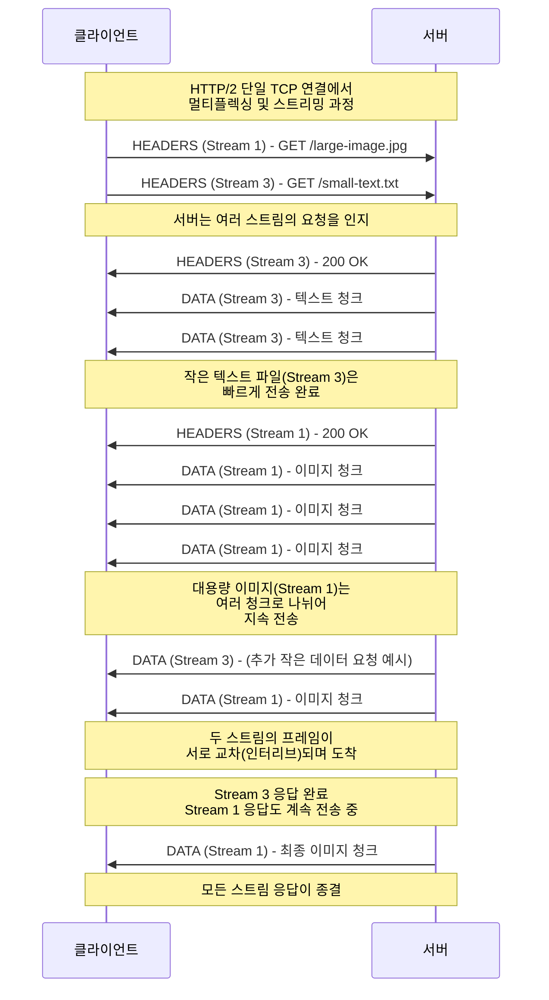

인터넷이 대중화되고 웹 애플리케이션이 복잡해짐에 따라, 더 빠르고 효율적인 통신 프로토콜에 대한 수요가 늘어났습니다. 전통적으로 사용되던 HTTP/1.1 프로토콜은 단순성과 호환성이 뛰어났지만, 오늘날과 같은 방대한 데이터를 처리하는 데 한계를 보였습니다. 이러한 문제점을 해결하기 위해 등장한 것이 HTTP/2입니다. 특히 HTTP/1.1에서 발생하던 HOL(Head of Line) Blocking 문제를 해결함으로써 웹 성능을 개선하였는데, 아래에서는 HTTP/2가 HOL Blocking 문제를 어떻게 해결하는지 그 원리와 주요 특징을 살펴보겠습니다.

## HTTP/1.1의 HOL Blocking 문제

HTTP/1.1에서는 클라이언트가 서버에 여러 요청을 보낼 때 요청이 순차적으로 처리됩니다. 즉, 첫 번째 요청의 전송이 완료되어야 비로소 두 번째 요청이 전송될 수 있습니다. 이로 인해 큰 파일(예: 이미지)이 먼저 요청되면, 상대적으로 작은 파일(예: 텍스트)은 큰 파일 전송이 끝날 때까지 대기하게 됩니다. 이런 구조가 **Head of Line Blocking** 문제의 원인이 됩니다.

이를 완화하고자 브라우저들은 여러 TCP 연결을 동시에 열어 병렬 전송을 시도했지만, 서버와 클라이언트 입장에서 비효율적으로 리소스를 점유한다는 단점이 있었습니다.

---

## HTTP/2의 스트림과 멀티플렉싱

HTTP/2는 이러한 HOL Blocking 문제를 해결하기 위해 **스트림(Stream)**과 **멀티플렉싱(Multiplexing)** 기능을 도입했습니다. HTTP/2에서의 스트림은 클라이언트와 서버 간에 교환되는 양방향 프레임들의 독립적인 시퀀스이며, 하나의 TCP 연결 안에서 동시에 여러 스트림을 생성할 수 있습니다.

이러한 스트림을 여러 개 ‘병렬’로 처리할 수 있게 만드는 기술이 **멀티플렉싱**입니다. 즉, 하나의 TCP 연결만으로도 여러 요청과 응답을 동시에 주고받을 수 있게 되어, HOL Blocking 문제를 효과적으로 줄일 수 있습니다.

---

### Stream State

HTTP/2 스트림은 다음과 같은 상태를 가지며, 이를 통해 각 엔드포인트가 스트림의 생성, 유지, 종료를 효율적으로 관리합니다.

1. **idle**: 모든 스트림의 초기 상태
2. **reserved (local)**: PUSH_PROMISE 프레임을 전송하여 예약된 스트림
3. **reserved (remote)**: 원격 피어에 의해 예약된 스트림
4. **open**: 양쪽 피어가 모든 유형의 프레임을 전송할 수 있는 상태
5. **half-closed (local)**: WINDOW_UPDATE, PRIORITY, RST_STREAM 외의 프레임을 전송할 수 없는 상태
6. **half-closed (remote)**: 피어가 더 이상 프레임을 전송하지 않는 상태
7. **closed**: 최종 상태

---

### 멀티플렉싱으로 HOL Blocking 문제 완화

HTTP/1.1에서 큰 파일 전송으로 인해 다른 리소스의 요청·응답이 지연되던 문제는, HTTP/2의 멀티플렉싱을 통해 극복될 수 있습니다. 
같은 TCP 연결 내에 여러 스트림을 생성하고, 각각의 요청과 응답을 독립적으로 처리함으로써 한 스트림이 지연되어도 다른 스트림에는 영향을 주지 않도록 설계되었습니다.

아래 시퀀스 다이어그램은 하나의 TCP 연결에서 큰 이미지와 작은 텍스트 파일을 동시에 요청하고, 각각의 리소스를 ‘스트리밍’ 방식으로 전송받는 과정을 보여줍니다.

## 스트림 우선순위

HTTP/2는 또한 각 스트림에 우선순위를 지정할 수 있는 기능을 제공합니다. 클라이언트는 중요한 리소스(예: HTML, CSS, JS)에 더 높은 우선순위를 부여하여, 서버가 리소스를 보다 효율적으로 할당하도록 유도할 수 있습니다.

1. 스트림은 다른 스트림에 종속 관계(Dependency)를 설정할 수 있습니다.
2. 종속 관계에는 상대적 가중치(1~256)를 부여할 수 있습니다.
3. 동일한 부모 스트림에 종속된 스트림들은 각자의 가중치 비율에 따라 리소스를 배분받게 됩니다.

---

## 흐름 제어(Flow Control)

HTTP/2에는 **스트림 레벨**과 **연결 레벨**에서 작동하는 흐름 제어 메커니즘도 존재합니다. 이는 `WINDOW_UPDATE` 프레임을 통해 이루어지며, 빠른 생산자와 느린 소비자 간의 전송 속도를 조절하여 **서버나 클라이언트가 과도한 리소스를 소비하지 않도록** 돕습니다.

- 흐름 제어는 연결별로 관리됩니다.
- `WINDOW_UPDATE` 프레임을 통해 수신자가 송신자에게 어느 정도의 데이터를 더 받을 수 있는지 알립니다.
- 초기 흐름 제어 창 크기는 65,535 옥텟입니다.
- 데이터 프레임만 흐름 제어의 대상이 됩니다.

---

## 맺음말

>HTTP/2는 **스트림과 멀티플렉싱**을 통해 기존 HTTP/1.1의 문제였던 HOL Blocking을 완화했습니다. 
> **스트림 우선순위**와 **흐름 제어**와 같은 부가 기능을 통해, 오늘날 복잡하고 데이터가 많은 웹 환경에서도 효율적입니다.
> 현재는 대부분의 브라우저와 서버가 HTTP/2를 지원하고 있습니다.

> 이 글이 도움이 되었기를 바랍니다. 

