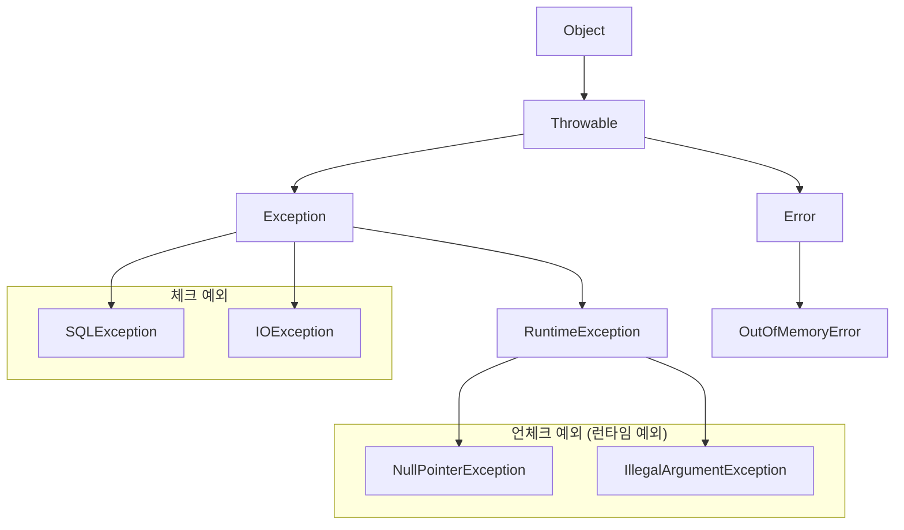
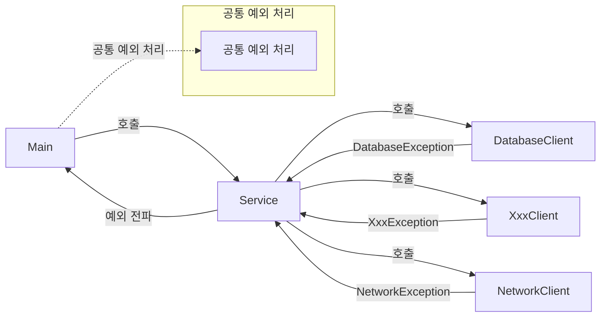

자바 프로그램 개발 시 예외 상황을 올바르게 관리해야 합니다.
본 글에서는 자바의 예외 계층 구조, 체크 예외와 언체크 예외의 차이, 공통 예외 처리 방법에 대해 알아보겠습니다.

## 자바 예외 계층 구조

자바에서 예외는 객체로 다루어집니다. Throwable을 최상위로 하여 Error와 Exception 두 가지로 분류됩니다.



- **Throwable**: 모든 예외의 최상위 클래스이다.
- **Error**: 시스템에서 발생하는 심각한 예외이며, 복구가 불가능하다.
- **Exception**: 애플리케이션 로직에서 발생할 수 있는 예외이며 체크 예외와 언체크 예외로 나뉜다.

## 체크 예외와 언체크 예외

- **체크 예외**: Exception과 그 하위 예외이며, 반드시 명시적으로 예외 처리(try-catch)하거나 throws 선언을 해야 한다.
- **언체크 예외**: RuntimeException과 그 하위 예외이며, 명시적 예외 처리가 필수는 아니다.

| 구분 | 체크 예외 | 언체크 예외 |
|------|----------|-------------|
| throws 선언 필수 여부 | 필수 | 선택 |
| 컴파일러 체크 여부 | 체크함 | 체크하지 않음 |

## 공통 예외 처리 방법

개별적인 예외 처리보다는 처리할 수 없는 예외들을 공통으로 처리하는 방식이 효율적입니다.



이러한 공통 처리로 코드의 가독성과 유지보수성을 높일 수 있습니다.

## Try-with-resources

자원을 자동으로 닫아주는 Try-with-resources는 자바 7에서 도입된 기능입니다. 
이를 통해 자원의 누수를 방지하고, 코드가 간결해지며 가독성이 향상되었습니다.

### 장점
- 리소스 누수 방지
- 코드 간결성 및 가독성 향상
- 자원의 스코프 한정
- 자원 해제 속도 향상

```java
try {
    networkService.sendMessage(input);
} catch (Exception e) {
    exceptionHandler(e);
}
```

## 맺음말
> 체크 및 언체크 예외의 적절한 활용, 예외 공통 처리 방법에 대한 이해에 도움이 되었기를 바랍니다.
