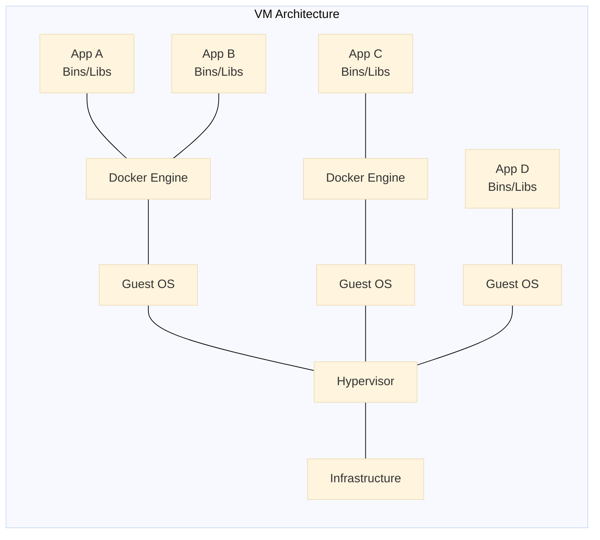
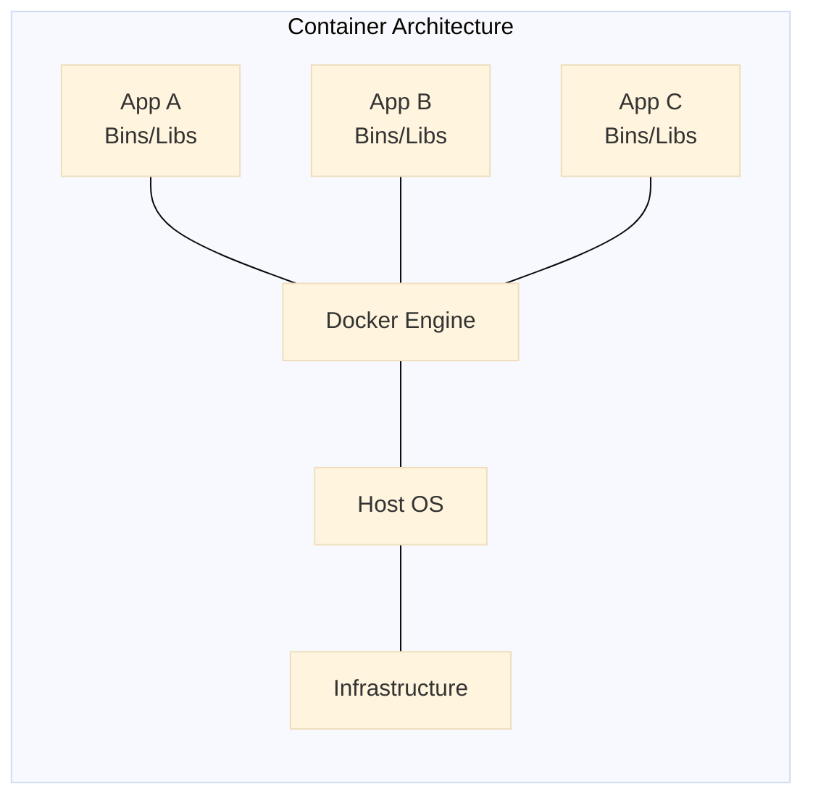

Docker는 프로그램을 어떤 컴퓨터에서도 에러 없이 설치하고 실행할 수 있도록 돕는 도구입니다. 복잡한 설치 과정이나 운영체제, 버전 차이로 인한 문제를 해결합니다. 설치를 간편하게 하고, 항상 일관된 환경을 제공합니다. 또한 프로그램 간 충돌 없이 독립적으로 실행할 수 있도록 합니다.

## Docker란?

위키피디아는 Docker를 다음과 같이 정의합니다.

> Linux에서 운영 체제 수준의 가상화를 자동화하고 추상화의 추가 계층을 제공하여 컨테이너 내부에서 소프트웨어 애플리케이션 배포를 자동화하는 오픈 소스 프로젝트

Docker는 개발자가 애플리케이션과 의존성 요소들을 하나의 표준화된 컨테이너에 담아 쉽게 배포하고 실행할 수 있도록 돕는 도구입니다. 가상 머신(VM)과 달리 컨테이너는 시스템 자원을 효율적으로 사용합니다.

## 컨테이너란?

현재 표준은 주로 가상 머신(VM)을 사용하여 애플리케이션을 실행하는 것입니다. VM은 게스트 운영체제 위에서 애플리케이션을 실행하며, 이는 다시 호스트 운영체제 위에서 가상 하드웨어를 사용하여 동작합니다.



VM은 각 애플리케이션을 완전히 분리된 별도의 컴퓨터처럼 따로따로 실행시킵니다. 한 프로그램이 망가져도 다른 프로그램에는 영향을 주지 않는 분리 효과를 얻을 수 있습니다. 하지만 이런 분리를 위해 가상의 하드웨어를 만들어야 해서 컴퓨터 자원이 많이 소모됩니다. 반면 컨테이너는 같은 운영체제 안에서 프로그램끼리 필요한 부분만 구분해서 나누어 쓰는 방식입니다. 서로 간섭 없이 독립적으로 실행되면서도, VM보다 훨씬 가볍게 동작할 수 있습니다.




## 컨테이너를 사용하는 이유

컨테이너는 애플리케이션을 실행 환경에서 추상화하여 논리적으로 패키징합니다. 이를 통해 애플리케이션은 데이터센터, 클라우드, 개인 노트북 등 어떤 환경에서도 일관성 있게 쉽게 배포될 수 있습니다. 또한 컨테이너는 세밀한 리소스 제어가 가능하여 인프라 효율성을 높이고 컴퓨팅 자원 활용도를 향상시킵니다.

이러한 장점 때문에 Docker는 Google, Facebook, Netflix, Salesforce와 같은 대기업에서 널리 채택되었습니다.

## 시작하기

```bash
docker run hello-world
```

Busybox 컨테이너를 실행해봅시다.

```bash
docker pull busybox
```

이미지 목록 확인:

```bash
docker images ls
```

컨테이너 실행:

```bash
docker run busybox
```

위 명령어는 아무 출력도 없습니다. 실제로는 컨테이너가 즉시 종료된 것입니다. 다음과 같이 명령어를 명시하여 실행할 수 있습니다.

```bash
docker run busybox echo "hello from busybox"
```

실행 중인 컨테이너 확인:

```bash
docker ps
```

모든 컨테이너 목록 확인:

```bash
docker ps -a
```

컨테이너 내부에서 여러 명령어 실행 (인터랙티브 모드):

```bash
docker run -it busybox sh
```

컨테이너 삭제:

```bash
docker rm <container_id>
```

모든 종료된 컨테이너 한 번에 삭제:

```bash
docker rm $(docker ps -a -q -f status=exited)
```

사용하지 않는 이미지 삭제:

```bash
docker rmi <image_id>
```

## 용어 정리

Docker에서 자주 사용되는 용어를 간단히 정리합니다.

- 이미지(Image): 컨테이너의 설계도로, 애플리케이션과 관련된 모든 정보가 포함됩니다. `docker pull`로 이미지를 다운로드합니다.
- 컨테이너(Container): 이미지를 기반으로 생성된 실제 애플리케이션 실행 환경입니다. `docker run`으로 생성됩니다.
- Docker 데몬(Daemon): Docker 컨테이너를 빌드하고 실행하며 관리하는 호스트의 백그라운드 서비스입니다.
- Docker 클라이언트(Client): 사용자가 Docker 데몬과 상호작용하는 명령어 도구입니다.
- Docker Hub: Docker 이미지가 저장된 레지스트리(저장소)입니다. 필요하면 자신만의 레지스트리를 설정하여 사용할 수도 있습니다.
- 볼륨(Volume): 컨테이너가 생성되고 삭제되더라도 데이터를 안전하게 보존하기 위해 사용하는 외부 저장소입니다. docker volume 명령어로 관리할 수 있습니다.

Docker는 컨테이너 기반의 애플리케이션 배포를 쉽고 효율적으로 만들어줍니다. Docker를 이해하는데 도움이 되었기를 바랍니다.

