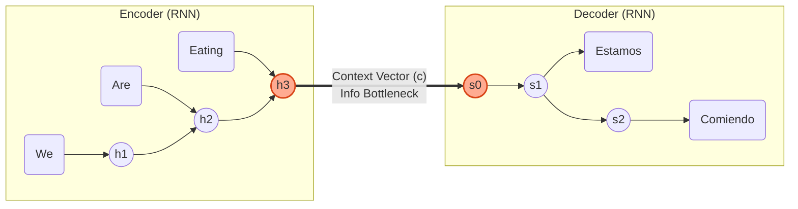
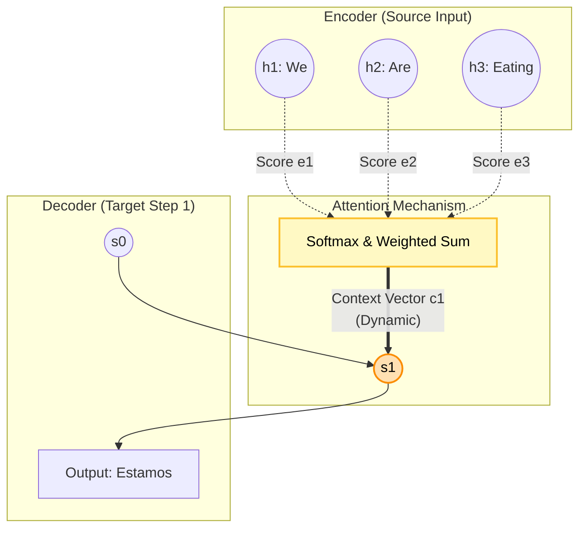

RNN 기반 Seq2Seq 모델의 한계점과 이를 극복하기 위한 Attention 메커니즘의 발전 과정을 다룹니다. 기존 구조의 문제점(Bottleneck)을 짚은 뒤, 어텐션의 수식적 정의와 시각적 설명, 그리고 최종적으로 Transformer로 이어지는 개념적 연결을 정리합니다.

## RNN 기반 Seq2Seq의 기본 구조와 한계

### 인코더와 디코더의 구조

Seq2Seq는 입력 시퀀스를 인코더가 처리해 하나의 벡터(Context Vector)로 압축하고, 디코더가 이를 기반으로 출력을 생성하는 구조입니다.

인코더의 계산은 다음과 같습니다.

$$h_t = f(x_t, h_{t-1})$$

(여기서 $$x_t$$는 t번째 입력 토큰, $$h_t$$는 해당 시점의 hidden state입니다.)

디코더는 다음과 같이 진행합니다.

$$s_t = g(y_{t-1}, s_{t-1}, c)$$

($$c$$는 인코더의 최종 hidden state입니다.)

### 병목 문제 (Bottleneck)

인코더의 모든 입력 정보가 단 하나의 벡터 $c$에 압축되어야 하므로, 입력 문장의 길이가 길어질수록 앞부분의 정보가 소실되거나 성능이 급격히 떨어지는 문제가 발생합니다.

"We are eating bread"라는 입력 시퀀스가 고정된 크기의 벡터 하나로 억지로 압축되면서 발생하는 정보 손실을 시각화한 것입니다.

## 어텐션(Attention)의 등장

### 핵심 아이디어

디코더가 출력을 생성할 때, 고정된 벡터 $c$ 하나만 보는 것이 아니라 인코더의 모든 Hidden State $\{h_1, ..., h_T\}$를 매 시점마다 다시 참조하여, 현재 예측해야 할 단어와 연관된 부분에 집중(Attend)합니다.

### Alignment Score 계산

어텐션의 작동 원리는 디코더의 현재 상태와 인코더의 각 상태 간의 유사도를 구하는 것입니다.

1.  유사도 계산 (Alignment Score):
    $$e_{t,i} = a(s_{t-1}, h_i)$$
    (여기서 $a$는 Dot Product 또는 작은 MLP입니다.)

2.  정규화 (Softmax):
    $$\alpha_{t,i} = \frac{\exp(e_{t,i})}{\sum_{k} \exp(e_{t,k})}$$

3.  컨텍스트 벡터 생성 (Weighted Sum):
    $$c_t = \sum_{i} \alpha_{t,i} h_i$$

4.  디코더 업데이트:
    $$s_t = g(y_{t-1}, s_{t-1}, c_t)$$

### 구조 시각화

위 다이어그램은 각 $$h_i$$가 계산되어 $$c_t$$로 합쳐지는 과정을 보여줍니다. 실제 번역 과정에서는 단어 간의 연관성이 히트맵(Heatmap) 형태로 나타납니다.

위와 같은 히트맵을 통해 모델이 번역 시 입력 문장의 어느 단어에 집중하고 있는지 직관적으로 확인할 수 있습니다.

-----

## 이미지 캡셔닝과 공간 어텐션 (Spatial Attention)

어텐션 메커니즘은 텍스트뿐만 아니라 이미지 처리에도 적용될 수 있습니다. 이를 Spatial Attention이라고 합니다.

### CNN을 통한 특성 추출

이미지 $$I$$를 CNN에 통과시켜 $$H \times W$$ 그리드 상의 Feature Vector를 추출합니다.
$$z_{i,j} \in \mathbb{R}^D$$

이 $$z_{i,j}$$들을 마치 문장의 단어들처럼 취급하여 시퀀스로 처리합니다.

### Spacial Attention 수식

디코더의 상태 $$h_{t-1}$$를 Query로 사용하고, 이미지의 각 위치 특성 $$z_{i,j}$$를 Key/Value로 사용합니다.

$$e_{t,(i,j)} = a(h_{t-1}, z_{i,j})$$

$$\alpha_{t,(i,j)} = \text{softmax}(e_{t,(i,j)})$$

$$c_t = \sum_{i,j} \alpha_{t,(i,j)} z_{i,j}$$

이 과정을 통해 모델은 캡션을 생성할 때 이미지의 특정 영역을 "쳐다보게" 됩니다.

위 예시처럼 "Bird"를 출력할 때는 새의 영역을, "Water"를 출력할 때는 물의 영역을 밝게 비추며 집중하는 것을 볼 수 있습니다.

-----

## Transformer로의 연결: Self-Attention

RNN의 순차적 처리 방식은 병렬 처리가 불가능하다는 단점이 있었습니다. Transformer는 과감하게 RNN을 제거하고, 오직 어텐션(Self-Attention)만으로 시퀀스를 처리합니다.

여기서 정리한 일반화된 어텐션 구조가 Transformer의 Multi-Head Self-Attention으로 확장됩니다.

### Self-Attention 수식

입력 벡터 $$X$$로부터 Query(Q), Key(K), Value(V)를 생성하여 다음 연산을 수행합니다.

$$\text{Attention}(Q,K,V) = \text{softmax}\left( \frac{QK^\top}{\sqrt{d_k}} \right) V$$

이 구조는 문장 내의 모든 단어 간의 관계를 한 번에 계산할 수 있어 병렬 처리에 매우 유리합니다.

Transformer는 이러한 Self-Attention 블록을 여러 층 쌓아 올려(Encoder-Decoder Stack), 현재 자연어 처리 분야의 표준이 되었습니다.

## 맺음말

> RNN 기반 Seq2Seq는 단일 컨텍스트 벡터에 의존하는 병목 현상이 있었으며, 이를 해결하기 위해 디코더가 입력의 모든 정보를 참조하는 어텐션이 등장했습니다. 이는 이미지 캡셔닝 등 다양한 분야로 확장되었으며, 결국 RNN을 완전히 대체하는 Transformer 아키텍처의 근간이 되었습니다.
