초기 단순 분류 문제에서 시작하여 픽셀 단위의 예측을 수행하는 Semantic Segmentation, 그리고 R-CNN 계열을 거쳐 실시간 탐지가 가능한 Faster R-CNN 및 Single-Stage Detector(YOLO, SSD)로 이어지는 기술적 흐름을 포함하고 있습니다. 정교한 마스크 생성을 위한 Mask R-CNN까지 포괄하고 있어 시각 인공지능의 핵심 알고리즘들을 이해하는 데 큰 도움이 되는 자료입니다.

아래에 해당 내용을 논리적 흐름에 따라 상세히 요약 정리하였습니다.

## 컴퓨터 비전의 주요 작업 (Computer Vision Tasks)
* Classification (분류): 이미지에 있는 객체가 무엇인지(예: 고양이) 판별합니다. 
* Semantic Segmentation (시맨틱 세그멘테이션): 픽셀 단위로 분류하되, 동일한 클래스의 개체들을 구분하지 않습니다 (예: 모든 소를 같은 '소' 픽셀로 처리). 
* Object Detection (객체 탐지): 객체의 위치를 Bounding Box로 찾고 클래스를 분류합니다. 개별 개체를 구분합니다. 
* Instance Segmentation (인스턴스 세그멘테이션): 객체 탐지와 세그멘테이션을 결합하여, 픽셀 단위로 분류하면서 개별 개체(Instance)까지 구분합니다.

## 시맨틱 세그멘테이션 (Semantic Segmentation)

이미지의 모든 픽셀에 카테고리 라벨을 지정하는 작업입니다.

### 접근 방식의 발전
* Sliding Window: 작은 패치 단위로 이미지를 잘라 CNN으로 분류하는 방식은 계산 비용이 매우 비효율적입니다. 
* Fully Convolutional Networks (FCN): 전체 이미지를 한 번에 처리하기 위해 Fully Connected Layer를 Convolution Layer로 대체하여 공간 정보를 유지합니다.

### 해상도 복원 (Upsampling)
CNN을 거치며 작아진 특성 맵(Feature map)을 원본 이미지 크기로 복원하기 위해 Upsampling 기술이 필요합니다.

* Unpooling: Pooling 시의 위치 정보를 기억해두었다가 복원 시 해당 위치로 값을 되돌리는 방식(Max Unpooling 등)을 사용합니다. 
* Transposed Convolution (Learnable Upsampling): 학습 가능한 필터를 사용하여 해상도를 키우는 방식입니다. 입력 픽셀에 필터를 곱해 출력 영역에 더하는 방식으로 작동합니다.

## 객체 탐지 (Object Detection)

객체 탐지는 "분류(Classification) + 위치 추정(Localization)" 문제입니다.

### 단일 객체 vs 다중 객체

* 단일 객체: 고정된 수의 출력(클래스 점수 + Bounding Box 좌표 4개)을 가지므로 회귀(Regression) 문제로 처리 가능합니다. 
* 다중 객체: 이미지마다 객체의 수가 다르기 때문에 단순 회귀로 풀기 어렵습니다. 이를 해결하기 위해 슬라이딩 윈도우 방식을 고려할 수 있으나 너무 느립니다.

### R-CNN 계열의 발전 (2-Stage Detectors)
객체 탐지 모델은 속도와 정확도를 개선하며 R-CNN -> Fast R-CNN -> Faster R-CNN으로 발전했습니다.

```mermaid
graph TD

    subgraph "Faster R-CNN"
    C1[입력 이미지] --> C2[ConvNet]
    C2 --> C3[RPN<br/>Region Proposal Network]
    C3 --> C4[RoI Pooling]
    C4 --> C5[Detection Head]
    end
    
    subgraph "Fast R-CNN"
    B1[입력 이미지] --> B2[ConvNet<br/>한 번만 실행]
    B2 --> B3[Feature Map]
    B3 --> B4[RoI Pooling]
    B4 --> B5[FC Layers]
    end
    
        subgraph "R-CNN (Slow)"
    A1[입력 이미지] --> A2[Region Proposals<br/>Selective Search]
    A2 --> A3[ConvNet<br/>독립적 실행]
    A3 --> A4[SVMs + Bbox Reg]
    end
```

### R-CNN (Slow R-CNN)
* 작동 방식: Selective Search로 약 2,000개의 영역 제안(Region Proposal)을 추출하고, 각 영역을 CNN에 통과시켜 분류합니다. 
* 문제점: 각 영역마다 CNN을 돌려야 해서 매우 느립니다 (이미지당 2,000번의 Forward pass).

### Fast R-CNN

* 아이디어: 이미지를 CNN에 한 번만 통과시켜 Feature Map을 얻습니다. 
* RoI Pooling: Feature Map 상에서 해당 영역(RoI)을 추출하여 고정된 크기로 변환합니다. 
* 문제점: 여전히 영역 제안(Region Proposal) 단계가 외부 알고리즘(Selective Search)에 의존하여 전체 속도의 병목이 됩니다.

### Faster R-CNN

* 혁신: CNN이 직접 영역 제안을 하도록 만듭니다 (Region Proposal Network, RPN). 
* Anchor Box: Feature Map의 각 지점에서 다양한 크기와 비율을 가진 Anchor Box를 사용하여 객체 유무와 좌표 보정을 예측합니다. 
* 결과: 모든 과정이 GPU 상에서 딥러닝으로 처리되어 실시간에 가까운 속도를 달성했습니다.

### Single-Stage Detectors (YOLO, SSD)
* 개념: 영역 제안 단계 없이, 이미지를 그리드로 나누고 각 셀에서 바로 객체와 좌표를 예측합니다. 
* 특징: Faster R-CNN(2-Stage)보다 속도는 훨씬 빠르지만, 정확도는 다소 낮을 수 있습니다.

### 인스턴스 세그멘테이션 (Instance Segmentation)

Mask R-CNN

Faster R-CNN을 확장하여 객체 탐지와 동시에 픽셀 단위 마스크(Mask)를 생성하는 모델입니다.
* 구조: Faster R-CNN의 분류/박스 헤드에 Mask Branch를 추가했습니다. 
* RoI Align: 기존 RoI Pooling은 좌표를 정수로 반올림(Quantization)하면서 위치 오차가 발생했습니다. Mask R-CNN은 Bilinear Interpolation을 사용하는 RoI Align을 도입하여 픽셀 단위의 정교한 정렬을 가능하게 했습니다.

### 요약 및 프레임워크
* 성능 트레이드오프: Faster R-CNN은 더 정확하지만 느리고, SSD/YOLO는 빠르지만 정확도가 떨어지는 경향이 있습니다. 백본(Backbone) 네트워크가 깊을수록 성능이 좋습니다. 
* 오픈소스 프레임워크: TensorFlow Detection API 와 PyTorch 기반의 Detectron2 가 널리 사용됩니다.

## 맺음말

>단순한 이미지 분류를 넘어, 이미지를 픽셀 단위로 이해하고 객체의 위치를 정확히 찾아내는 기술들이 어떻게 발전해왔는지 확인할 수 있었습니다. 
> R-CNN에서 Faster R-CNN으로 이어지는 과정은 '계산 효율성'과 'End-to-End 학습'이라는 딥러닝 연구의 주요 지향점을 잘 보여줍니다. RoI Align과 같은 정교한 기술을 통해 객체 탐지와 세그멘테이션이 결합된 Mask R-CNN과 같은 고도화된 모델이 등장했습니다. 
> 정리해드린 내용이 컴퓨터 비전 분야의 핵심 알고리즘을 체계적으로 이해하시는 데 도움이 되기를 바랍니다.
