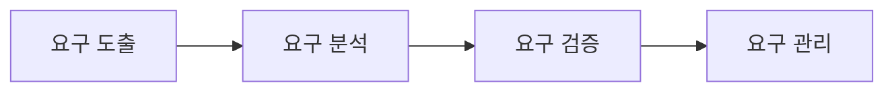
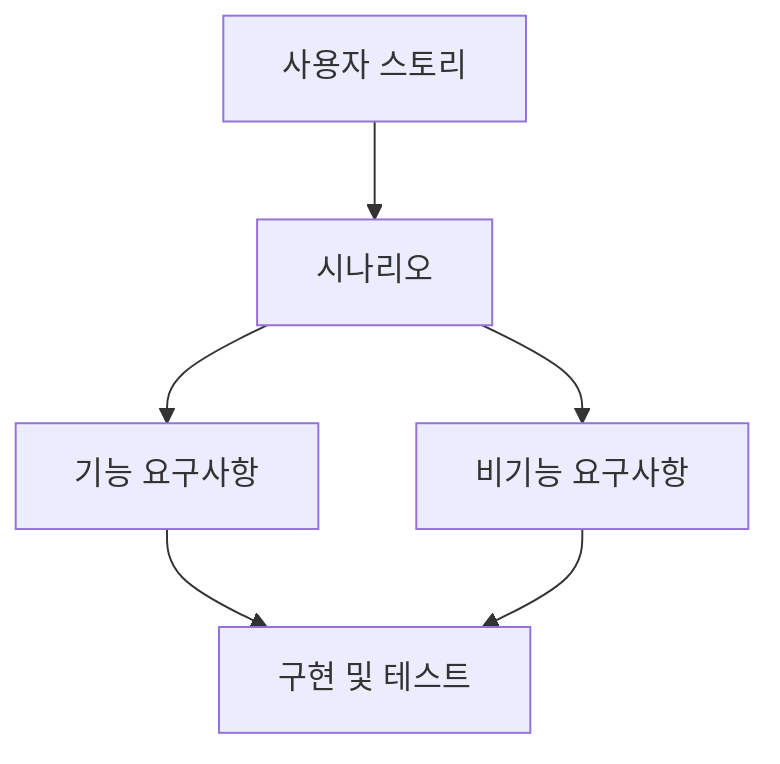

소프트웨어 공학에서 요구사항은 시스템이 제공해야 하는 서비스와 지켜야 하는 제약을 의미합니다. 요구사항 공학은 고객이 원하는 서비스를 파악하고, 개발·운영 과정에서 발생하는 제약을 함께 식별하여 합의 가능한 명세로 정리하는 반복적 활동입니다.
계획 기반 개발에서는 요구사항을 초기에 상세히 고정하려는 경향이 있으나, 애자일에서는 과도한 상세 요구사항이 낭비가 될 수 있다고 보며 사용자 스토리에서 출발해 점진적으로 구체화하는 흐름을 자주 사용합니다. 

## 요구사항의 정의와 분류

요구사항은 “시스템이 해야 하는 일”과 “시스템이 반드시 지켜야 하는 조건”으로 나뉘어 이해하는 것이 자연스럽습니다.

### 사용자 요구사항과 시스템 요구사항

사용자 요구사항은 이해관계자가 자연어에 가까운 형태로 기대 기능과 제약을 기술한 수준입니다. 시스템 요구사항은 개발·검증이 가능하도록 더 구체적이고 테스트 가능한 형태로 정리한 수준입니다.

### 기능 요구사항과 비기능 요구사항

기능 요구사항은 시스템이 어떻게 동작해야 하는지, 무엇을 해야 하고 무엇을 하면 안 되는지를 규정합니다.
비기능 요구사항은 시스템의 속성이나 제약을 규정하며, 보통 -ility / -ity(신뢰성, 보안성, 사용성, 안전성 등)로 표현되는 경우가 많습니다.
두 범주는 분리되어 보이지만 실제로는 강하게 얽혀 있습니다. 예를 들어 로그인 기능(기능)은 인증 강도·지연시간·접근통제(비기능)의 영향을 강하게 받습니다.

## 완전성과 일관성

요구사항 문서는 원칙적으로 완전하고 일관적이어야 합니다. 그러나 실제 환경은 복잡하여 “완전하고 일관된 문서”를 한 번에 만드는 것은 어렵다고 보는 관점이 타당합니다.

### 형식적 관점에서의 정리

요구사항 집합을 $$R = \{r_1, r_2, \dots, r_n\}$$라고 두면 다음처럼 생각할 수 있습니다.

완전성은 “필요한 기능·제약이 빠짐없이 포함되는 성질”입니다. 업무 범위(도메인 목표) 집합을 $$G$$라고 할 때, 각 목표 $$g \in G$$가 어떤 요구사항들로 커버되는지의 관점으로 표현할 수 있습니다.

$$
\forall g \in G,\ \exists r \in R \text{ such that } cover(r, g)=1
$$

일관성은 “요구사항들 사이에 모순이 없는 성질”입니다. 두 요구사항 $$r_i, r_j$$가 동시에 만족될 수 없는 경우를 충돌로 두면,

$$
\forall r_i, r_j \in R,\ i \neq j,\ \neg conflict(r_i, r_j)
$$

현실에서는 기술·비용·일정·규정 등 제약 때문에 위 조건들을 완벽히 만족시키기 어렵고, 따라서 반복적으로 보완하며 위험을 관리하는 접근이 필요해집니다.

## 요구사항 충돌과 트레이드오프

요구사항은 서로 연결되어 있어 충돌이 흔히 발생합니다. 특히 비기능 요구사항 사이의 트레이드오프가 대표적입니다. 보안·안전·신뢰성·성능·사용성·비용 등은 동시에 최대화하기 어렵습니다.

이를 “다목적 최적화” 관점으로 보면, 설계안(또는 운영 정책) $$x$$에 대해 여러 품질 속성 $$q_k(x)$$를 동시에 고려하게 됩니다.

$$
\max_x\ [q_{\text{security}}(x),\ q_{\text{usability}}(x),\ q_{\text{performance}}(x),\dots]
\quad \text{s.t.}\quad cost(x)\le B
$$

실무에서는 단일 해를 찾기보다, 합의된 우선순위(가중치) 또는 최소 기준(제약)을 두고 조정합니다.

$$
\max_x\ \sum_k w_k q_k(x)
\quad \text{s.t.}\quad q_k(x)\ge \tau_k
$$

이때 중요한 것은 “무엇을 포기했고 무엇을 지켰는지”를 요구사항 수준에서 추적 가능하게 남기는 것입니다.

---

## 요구사항 공학의 반복 프로세스

요구사항 공학은 요구 도출, 분석, 검증, 관리 활동을 반복적으로 수행합니다. 활동 간 경계가 항상 명확하지 않고 섞여 진행되는 경우가 많습니다. 

### 요구 도출

고객과 이해관계자로부터 요구를 알아내는 단계입니다. 인터뷰, 에스노그래피, 사용자 스토리/시나리오 등의 방법이 대표적입니다.
“우리가 곧 고객이다”라는 상황에서는 내부 사용자의 업무 흐름 관찰과 로그 기반 가설 설정이 유용할 수 있으나, 실제 고객의 맥락과 다를 수 있어 확인 과정이 필요합니다.

### 요구 분석

요구사항을 분류하고, 모호함을 줄이고, 충돌을 찾아 조정하는 단계입니다. 기능/비기능의 연결을 명시하고, 테스트 가능성(검증 가능성)을 높이는 방향으로 구체화합니다.

### 요구 검증

요구사항이 올바른지, 빠진 것은 없는지, 모순이 없는지 점검합니다. 리뷰, 프로토타이핑, 테스트 케이스 생성이 대표적 방법입니다.
검증에서 확인해야 하는 대표 속성은 완전성, 일관성, 타당성, 검증 가능성입니다.

### 요구 관리

변경을 통제하고 추적하는 단계입니다. 요구사항은 시간이 지나며 바뀌는 것이 자연스러우므로, 변경 이력과 영향 범위를 다루는 체계가 필요합니다.

## 사용자 스토리에서 요구사항으로의 변환

애자일에서는 자연어 사용자 스토리에서 요구사항을 뽑아내고, 다시 실행 가능한 작업 항목(To-do)으로 바꾸는 흐름이 자주 쓰입니다.
사용자 스토리를 더 구조화하면 시나리오가 됩니다. 시나리오는 시작 상황, 정상 흐름, 실패/예외, 종료 상태를 포함하는 형태가 일반적입니다.

### 예시 스토리의 익명화된 재서술

한 사용자가 이사할 때 여러 방을 비교·방문하는 일이 번거로워, 예산과 선호 조건을 입력하면 지도에서 조건에 맞는 매물을 보여주는 서비스가 필요하다고 가정합니다. 또한 사용 이력 기반으로 자주 가는 장소까지의 거리 계산을 지원해 이사 후 생활 유지 가능성을 판단하고 싶다고 가정합니다.

이 스토리에서 기능 요구사항은 다음처럼 도출될 수 있습니다.

* 예산·조건 입력 기능
* 지도 기반 매물 필터링 및 표시 기능
* 매물 선택 시 거리/접근성 계산 기능
* 사용자가 장소를 수동 등록하는 기능

비기능 요구사항은 다음처럼 연결됩니다.

* 개인정보 보호 및 접근 통제(카드 사용 이력 등 민감 정보)
* 응답 시간과 지도 렌더링 성능
* 거리 계산의 정확도 및 외부 API 장애 대비
* 사용성(조건 입력의 단순성, 오류 메시지 품질)

이 단계에서 중요한 점은 “기능 목록”만 나열하는 것이 아니라, 기능이 성립하기 위해 필요한 제약과 품질 조건을 함께 적어야 한다는 점입니다.

## GenAI/LLM을 요구사항에 적용하는 관점

특정 유형의 소프트웨어는 공통 요구사항이 많아 빠르게 초안을 만들 수 있다는 기대가 존재합니다. 사용자 스토리를 주고 요구사항을 뽑게 하는 방식도 가능합니다. 다만 모델이 만든 결과가 실제 고객의 의도와 어긋날 수 있으므로, 결과를 그대로 신뢰하지 않고 확인·수정 흐름을 포함해야 합니다.
최근에는 요구사항 생성·평가·관리뿐 아니라 자연어 요구에서 코드로 이어지는 방향도 관심을 받습니다.

## 맺음말

> 요구사항 공학은 무엇을 만들 것인지를 결정하는 문제가 아니라, 무엇을 만들 수 있고 무엇을 포기할지를 합의하는 과정입니다.기능 요구사항과 비기능 요구사항은 분리된 목록이 아니라 서로 영향을 주는 연결 구조로 다루는 것이 합리적입니다. 
> 요구 도출–분석–검증–관리의 반복을 통해 변경을 수용하면서도 품질과 합의를 유지하는 것이 핵심입니다.

