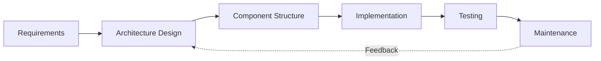
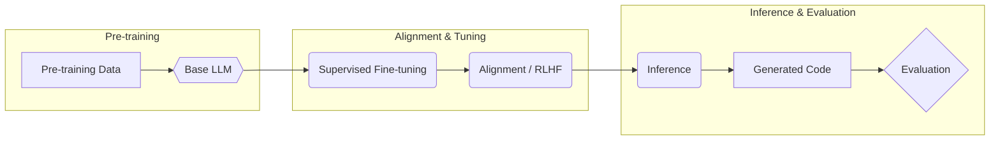

설계와 구현은 요구사항을 실제 동작하는 소프트웨어로 바꾸는 단계입니다. 이 단계의 핵심은 코드를 많이 작성하는 것이 아니라, 변경에 강하고 유지 가능한 구조를 선택하는 데 있습니다. 특히 아키텍처 수준의 설계 결정은 이후 구현 비용에 큰 영향을 미칩니다.

## Architectural Design

아키텍처 설계는 시스템의 전체 구조를 정의합니다. 구성 요소를 나열하는 것이 아니라, 주요 컴포넌트와 그 관계를 결정하는 단계입니다. 이 단계에서 내려진 결정은 이후 변경 비용이 매우 큽니다.

아키텍처 설계의 특징은 다음과 같습니다.

- 요구사항과 상세 설계를 연결하는 중간 단계입니다.
- 시스템의 주요 컴포넌트와 상호작용을 정의합니다.
- 작은 변경도 다수의 컴포넌트에 영향을 미칠 수 있습니다.
- 일단 결정되면 수정 비용이 매우 큽니다.

## Architectural Design Decisions

아키텍처 설계에서는 다음과 같은 질문들이 핵심이 됩니다.

- 기존에 재사용 가능한 애플리케이션 아키텍처가 있는지 여부
- 어떤 아키텍처 스타일이나 패턴을 사용할지 여부
- 시스템을 어떤 기준으로 하위 컴포넌트로 분해할지 여부

이러한 결정은 시스템 규모, 변경 가능성, 성능 요구, 팀 역량 등에 따라 달라집니다.

## Architecture Reuse

유사한 유형의 시스템은 유사한 요구사항을 가지는 경우가 많습니다. 이로 인해 특정 유형의 시스템에 적합한 아키텍처를 일반화하여 재사용할 수 있습니다.

- Generic Application Architecture는 특정 시스템 유형에 대해 미리 정의된 구조입니다.
- Architectural Pattern은 반복적으로 검증된 설계 해결책입니다.
- 대표적인 예로 Client–Server, MVC 구조가 있습니다.

아키텍처 재사용은 설계 시간을 줄이고, 실패 위험을 낮추는 데 기여합니다.

## Design and Implementation 관계

전통적인 객체지향 개발에서는 설계와 구현을 명확히 구분하고, 다양한 설계 모델을 문서로 유지했습니다. 그러나 이러한 방식은 유지 비용이 크고 변화에 취약합니다.

애자일 환경에서는 설계와 구현을 분리된 단계로 보지 않습니다.

- 설계는 코드 작성과 동시에 이루어집니다.
- 객체를 식별하는 작업이 곧 클래스 파일을 만드는 작업이 됩니다.
- 문서보다 실행 가능한 코드가 우선됩니다.

설계는 더 이상 “사전에 끝내야 할 작업”이 아니라, 구현 과정에서 계속 보완되는 활동입니다.

## Design Patterns

디자인 패턴은 특정 문제 유형에 대해 반복적으로 검증된 설계 아이디어입니다. 이는 구체적인 코드가 아니라, 구조와 역할에 대한 추상적인 해법입니다.

- 반복자, 옵저버, 팩토리 패턴 등이 대표적입니다.
- 성능, 보안, 유지보수성 문제를 구조적으로 해결하는 데 사용됩니다.
- 패턴 연구는 문제–해결 구조를 일반화하는 데 초점을 둡니다.

디자인 패턴의 목적은 코드를 복잡하게 만드는 것이 아니라, 변경 이유를 분리하는 데 있습니다.

## Implementation에 대한 SE 관점

구현 단계에서 가장 눈에 띄는 작업은 코드 작성이지만, 소프트웨어 공학 관점에서는 코드 작성 자체는 핵심 문제가 아닙니다.

- 개발자의 시간 중 코드 작성은 약 15% 수준입니다.
- 나머지는 이해, 디버깅, 수정, 커뮤니케이션에 사용됩니다.
- 코드 작성 자동화만으로 전체 생산성은 크게 개선되지 않습니다.

이 점은 Amdahl의 법칙으로 설명할 수 있습니다.

$$
Speedup = \frac{1}{(1 - P) + \frac{P}{S}}
$$

여기서 $$P$$는 자동화 가능한 비율이며, $$S$$는 해당 부분의 속도 향상입니다.  
코드 작성만 자동화해도 전체 개발 속도 향상은 제한적입니다.

## Architectural–Implementation

이 흐름은 아키텍처가 구현 이전에만 존재하는 것이 아니라, 유지보수 단계에서도 다시 영향을 받는다는 점을 보여줍니다.

## Code Generation과 LLM

최근에는 LLM이 다양한 코드 관련 작업을 수행할 수 있게 되었습니다. 

- 코드 완성 및 자동 보완 
- 언어 간 코드 변환 
- 버그 수정 
- 테스트 케이스 생성 
- 자연어로부터 코드 생성

자연어 설명을 입력으로 받아 코드를 생성하는 NL-to-Code 작업이 주목받고 있습니다.

## CodeLLM Workflow

이 흐름은 코드 생성 성능이 단순한 모델 크기뿐 아니라 학습 데이터, 정렬 방식, 평가 방법에 의해 결정됨을 보여줍니다.

## CodeLLM 평가 이슈

코드 생성 성능 평가는 일반적인 자연어 평가와 다릅니다. 
- BLEU, ROUGE와 같은 텍스트 유사도는 충분하지 않습니다. 
- 실제 실행 결과를 기준으로 평가하는 pass@1이 주로 사용됩니다. 
- 대부분의 벤치마크는 단위 테스트 통과 여부에 의존합니다.

이로 인해 다음과 같은 문제가 발생합니다.

- 학습 데이터와 평가 데이터 간 중복 가능성 
- 테스트를 통과하지만 의미적으로 잘못된 코드 
- 실제 개발 환경과 동떨어진 성능 과대평가

이는 자동 프로그램 수정 분야에서 오래전부터 지적된 문제와 유사합니다.

## 맺음말

> 설계와 구현의 핵심은 코드를 빠르게 작성하는 것이 아니라, 변경에 강인한 구조를 선택하는 데 있습니다. 
> 아키텍처 설계는 초기 비용이 크지만, 장기 유지 비용을 결정합니다. 
> LLM은 코드 작성과 관련된 여러 작업을 지원할 수 있으나, 전체 소프트웨어 생산성 향상으로 직결되지는 않습니다. 
> 설계 결정, 평가 기준, 실제 사용 맥락을 함께 고려하는 것이 소프트웨어 공학 관점에서 중요합니다.

