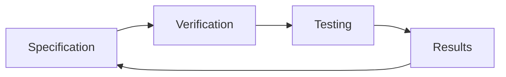
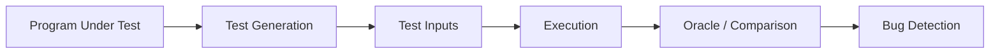

소프트웨어 검증은 구현된 소프트웨어가 주어진 명세를 정확히 따르는지를 확인하는 활동입니다. 검증의 핵심 질문은 “우리가 의도한 대로 만들었는가”입니다. 이는 사용자의 진짜 요구를 다루는 검증(validation)과 구분됩니다. 실제 개발에서는 명세 자체가 불완전한 경우가 많아, 검증과 검증 대상인 명세를 함께 개선하는 과정이 반복됩니다.

## Verification과 Validation의 구분

검증은 코드가 명세에 부합하는지를 확인합니다. 명세가 잘못되었더라도, 코드가 명세를 따르고 있다면 검증은 통과합니다. 반면 검증은 “무엇을 만들었어야 하는가”를 묻습니다.

- Verification
  - 명세 대비 구현의 적합성을 확인합니다.
  - 질문은 “Did we make it correctly?”입니다.
- Validation
  - 사용자 요구 대비 시스템의 적합성을 확인합니다.
  - 질문은 “Did we make the right thing?”입니다.

분리되어 있지만, 실제로는 강하게 연결되어 있으며 검증 결과가 명세 수정으로 이어지는 경우가 많습니다.

## 명세 기반 검증의 한계

검증은 명세를 전제로 수행되지만, 명세는 종종 문제를 포함합니다.

- 모호한 명세
  - 입력 조건이나 동작 범위가 명확하지 않습니다.
- 불완전한 명세
  - 일부 입력이나 상황이 정의되지 않습니다.
- 불일관된 명세
  - 서로 충돌하는 조건이 동시에 존재합니다.

애자일 개발 환경에서는 상세 명세 자체가 존재하지 않는 경우도 많아, 검증은 실행 중인 코드와 테스트를 중심으로 이루어집니다.

## Inspection과 Testing

소프트웨어 검증은 정적 분석과 동적 실행으로 나뉩니다.

- Inspection
  - 코드, 설정, 문서를 실행하지 않고 분석합니다.
  - 정적 분석 도구를 사용해 결함 가능성을 탐지합니다.
  - 빠르지만 거짓 경고(false positive)가 많을 수 있습니다.
- Testing
  - 실제로 프로그램을 실행해 동작을 확인합니다.
  - 테스트 입력과 기대 출력의 쌍을 사용합니다.
  - 실행 비용이 있지만 실제 오류를 드러낼 수 있습니다.

두 접근은 대체 관계가 아니라 상호 보완 관계입니다.

## 테스트의 기본 개념

테스트는 입력과 기대 출력의 쌍으로 구성됩니다.

- 하나의 테스트 케이스는 특정 동작을 검증합니다.
- 여러 테스트 케이스를 묶은 것이 테스트 스위트입니다.
- 테스트는 단위, 컴포넌트, 시스템 수준으로 구성될 수 있습니다.

단위 테스트 단계에서 결함을 발견할수록 수정 비용은 낮아집니다.

## Unit Test와 Regression Test

단위 테스트는 가장 작은 실행 단위를 대상으로 수행됩니다.

- 코드 변경 시 즉시 수행됩니다.
- Test-Driven Development에서는 테스트를 먼저 작성합니다.

회귀 테스트는 기존 기능이 깨지지 않았는지를 확인합니다.

- 모든 변경 후 기존 테스트를 다시 실행합니다.
- 지속적 통합 환경에서는 필수 요소입니다.
- 테스트 통과 없이는 변경이 반영되지 않습니다.

---

## Verification 전체 흐름

이 흐름은 검증이 명세를 고정된 기준으로 삼지 않고, 결과에 따라 명세 자체를 다시 점검하게 됨을 보여줍니다.

## 자동화된 테스트의 필요성

소프트웨어 규모가 커질수록 수작업 테스트는 한계를 가집니다.

* 테스트 수는 수천~수만 개로 증가합니다.
* 모든 테스트를 매 변경마다 실행하기 어렵습니다.
* 인적 비용은 매우 높습니다.

반면 자동화는 다음 장점을 가집니다.

* 낮은 실행 비용
* 24시간 실행 가능
* 대규모 병렬 처리 가능

이로 인해 자동화된 소프트웨어 테스트는 필수 요소가 되었습니다.

## 자동 테스트 생성

자동 테스트 생성은 프로그램을 입력으로 받아 테스트 입력을 생성하는 기술입니다.

* 코드 커버리지를 높이는 것이 목표입니다.
* 분기 커버리지, 경로 커버리지 등이 사용됩니다.
* 대표 도구로 Randoop, EvoSuite, Pynguin 등이 있습니다.

자동 생성의 핵심 문제는 다양한 실행 경로를 효과적으로 탐색하는 것입니다.

## 경로 탐색과 한계

분기가 증가할수록 실행 경로 수는 기하급수적으로 증가합니다.

* 분기 수가 n이면 가능한 경로는 2ⁿ에 가깝습니다.
* 이전 분기의 조건이 이후 분기에 영향을 미칩니다.
* 단순 무작위 접근은 확장성이 떨어집니다.

이를 해결하기 위해 기호 실행과 SMT 솔버가 사용됩니다.

## Concolic Testing

Concolic Testing은 구체 실행과 기호 실행을 결합한 방식입니다.

* 실제 입력으로 프로그램을 실행합니다.
* 실행 중 분기 조건을 기호식으로 수집합니다.
* 조건을 뒤집어 새로운 입력을 생성합니다.

이를 통해 낮은 확률의 오류 경로를 체계적으로 탐색할 수 있습니다.

## Fuzz Testing

Fuzz Testing은 무작위 또는 반무작위 입력을 생성해 프로그램의 비정상 종료를 유도합니다.

* 정상 입력을 변형해 새로운 입력을 생성합니다.
* 충돌이나 예외를 오류 신호로 사용합니다.
* 보안 취약점 탐지에 효과적입니다.

Greybox Fuzzing은 코드 커버리지를 활용해 의미 있는 입력만 유지합니다.

## Mutation Testing

Mutation Testing은 테스트 스위트의 품질을 평가하는 방법입니다.

* 프로그램에 작은 변이를 가한 mutant를 생성합니다.
* 테스트가 mutant를 탐지하면 해당 mutant는 제거됩니다.
* 제거되지 않은 mutant는 테스트의 취약 지점을 의미합니다.

이 방법은 테스트가 충분히 강한지를 판단하는 기준으로 사용됩니다.

## Test Oracle 문제와 대안

자동 입력 생성에 비해 기대 출력 생성은 어렵습니다.

* 기대 출력이 Test Oracle입니다.
* 정답 프로그램이 없는 경우 판단이 어렵습니다.

이를 보완하기 위한 접근이 존재합니다.

* Differential Testing

  * 여러 구현의 출력을 비교합니다.
* Metamorphic Testing

  * 입력 간 관계를 정의해 결과를 검증합니다.

## 자동 테스트 생성 전체 구조

이 구조는 입력 생성, 실행, 결과 판별이 분리된다는 점을 보여줍니다.

## GenAI와 소프트웨어 검증

최근에는 LLM을 활용한 테스트 자동화 연구가 활발합니다.

* 테스트 코드 자동 생성
* 입력 데이터 생성
* 퍼징 입력 생성
* 실패 유도 테스트 생성

다만 생성된 테스트의 정확성과 신뢰성은 여전히 검증 대상이며, 사람의 검토가 필요합니다.

## 맺음말

> 소프트웨어 검증은 명세와 구현의 일치를 확인하는 핵심 활동입니다. 
> 테스트는 가장 대표적인 검증 수단이며, 자동화 없이는 대규모 시스템을 다룰 수 없습니다. 
> 다양한 테스트 기법은 서로 다른 오류 유형을 탐지하며, 상호 보완적으로 사용됩니다. 
> 생성형 AI는 테스트 생성의 가능성을 크게 확장했지만, 결과의 신뢰성 문제를 해결하는 것은 여전히 중요한 과제입니다.

