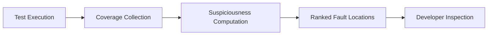
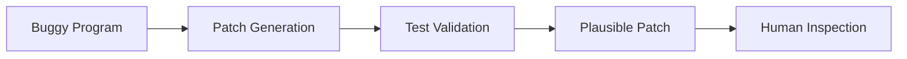

소프트웨어 디버깅은 오류가 발생했을 때 그 원인을 찾아 수정하는 활동입니다. 
소프트웨어 변화 과정에서 디버깅은 가장 많은 시간과 비용이 소요되는 작업 중 하나입니다. 
소프트웨어가 장기간 변화하는 현대 개발 환경에서는 디버깅을 개인의 숙련도에만 의존하기 어렵습니다. 
이로 인해 자동화된 디버깅 기법이 중요한 연구 주제로 자리 잡았습니다.

## Software Evolution과 Debugging

소프트웨어는 배포 이후에도 지속적으로 변경됩니다.

- 기능 추가
- 버그 수정
- 성능 개선
- 환경 변화 대응

애자일 개발에서는 개발과 유지보수의 경계가 희미해지며, 디버깅은 일회성 작업이 아니라 반복적인 활동이 됩니다. 이 과정에서 디버깅 효율은 전체 생산성에 직접적인 영향을 미칩니다.

## Debugging의 핵심 문제

디버깅의 본질적 질문은 다음과 같습니다.

- 오류를 발생시킨 원인은 무엇인가
- 코드의 어느 위치가 문제인가
- 어떻게 수정해야 하는가

이 질문은 각각 다른 난이도를 가지며, 자동화 연구 역시 이 구분을 중심으로 발전해 왔습니다.

## 자동화된 디버깅 접근

자동 디버깅 기법은 크게 세 방향으로 나뉩니다.

- Defect Prediction
  - 코드가 버그를 포함할 가능성을 예측합니다.
- Fault Localization
  - 실패를 유발한 코드 위치를 추정합니다.
- Automatic Program Repair
  - 코드 수정안을 자동으로 생성합니다.

Fault Localization과 Automatic Program Repair에 초점을 둡니다.

## Fault Localization 개념

Fault Localization은 실패한 테스트를 기준으로 오류의 원인이 되는 코드 위치를 추정하는 기법입니다.

- 입력은 실패한 테스트 결과입니다.
- 출력은 의심스러운 코드 위치의 순위 목록입니다.
- 개발자는 이 목록을 참고해 코드를 조사합니다.

대부분의 기법은 “오류가 있는 코드는 정상 코드와 다른 실행 특성을 보인다”는 가정을 기반으로 합니다.

## Spectrum-Based Fault Localization (SBFL)

SBFL은 가장 널리 사용되는 Fault Localization 기법입니다.

- 코드 커버리지 정보를 사용합니다.
- 테스트의 성공/실패 여부를 함께 고려합니다.
- 각 코드 단위에 대해 의심도(suspiciousness)를 계산합니다.

코드 단위는 보통 파일+라인 번호로 정의됩니다.

## SBFL의 통계적 직관

각 코드 단위에 대해 다음 네 가지 경우를 고려합니다.

- 실패 테스트에서 실행된 횟수
- 성공 테스트에서 실행된 횟수
- 실패 테스트에서 실행되지 않은 횟수
- 성공 테스트에서 실행되지 않은 횟수

실패 테스트에서 자주 실행되고, 성공 테스트에서는 덜 실행된 코드일수록 오류 가능성이 높다고 판단합니다.

이를 바탕으로 Jaccard, Tarantula, Ochiai 등의 유사도 계수가 사용됩니다.

## Fault Localization 흐름

이 흐름은 Fault Localization이 자동으로 “정답”을 주는 것이 아니라, 개발자의 탐색 범위를 줄여주는 도구임을 보여줍니다.

## Fault Localization 평가

Fault Localization의 결과는 순위 목록이므로, 평가 방식도 순위 기반입니다.

* EXAM score

  * 실제 오류 위치를 찾기까지 검사해야 하는 코드 비율입니다.
* Top-N

  * 상위 N개 후보 안에 실제 오류가 포함되는지 여부입니다.
* MRR / MAP

  * 올바른 위치가 얼마나 상위에 위치하는지를 평가합니다.

낮은 EXAM score와 높은 Top-N 성능이 바람직합니다.

## Fault Localization의 한계

SBFL 기법에는 구조적 한계가 존재합니다.

* 테스트 품질에 강하게 의존합니다.
* 동일한 의심도를 가진 위치가 다수 발생할 수 있습니다.
* 누락 오류(fault of omission)는 탐지하기 어렵습니다.
* 개발자의 실제 사고 과정과는 다소 차이가 있습니다.

이로 인해 다른 기법과의 결합이 필요합니다.

## Automatic Program Repair 개념

Automatic Program Repair는 버그가 있는 코드와 테스트 스위트를 입력으로 받아, 테스트를 통과하는 수정안을 생성하는 기술입니다.

* 입력: 버그 코드 + 실패 테스트
* 출력: 모든 테스트를 통과하는 패치

대부분의 기법은 generate-and-validate 전략을 사용합니다.

## Generate-and-Validate 관점

버그 수정은 탐색 문제로 볼 수 있습니다.

* 어디를 고칠 것인가
* 어떻게 고칠 것인가
* 어떤 변경이 테스트를 통과하는가

이로 인해 패치 후보 공간은 매우 커지며, 많은 기법이 비효율적인 탐색 문제에 직면합니다.

## Automatic Program Repair 흐름

이 구조는 테스트를 통과한 패치가 반드시 올바른 패치는 아니라는 점을 강조합니다.

## LLM 기반 Debugging

최근에는 대규모 언어 모델을 활용한 디버깅 기법이 활발히 연구되고 있습니다.

* Fault Localization 성능 향상
* 오류 위치에 대한 자연어 설명 제공
* 대화 기반 Program Repair

LLM은 코드 문맥과 오류 패턴을 동시에 활용할 수 있어 기존 기법보다 높은 성능을 보이는 경우가 많습니다.

## LLM 기반 접근의 한계

LLM 기반 디버깅에는 다음과 같은 문제가 남아 있습니다.

* 학습 데이터 포함 여부에 따른 데이터 누수 문제
* 테스트를 통과하지만 의미적으로 잘못된 패치
* 결과에 대한 신뢰성 문제

따라서 LLM의 결과는 자동 적용이 아니라, 보조 도구로 활용하는 것이 현실적입니다.

## 맺음말

> 소프트웨어 디버깅은 소프트웨어 변화 과정에서 가장 많은 비용이 소요되는 활동입니다. 
> Fault Localization은 오류 위치 탐색 비용을 줄이는 데 기여하며, Automatic Program Repair는 수정 후보 생성을 자동화합니다. 
> 대규모 언어 모델은 이 두 영역 모두에서 가능성을 크게 확장했으나, 결과의 정확성과 신뢰성은 여전히 사람의 판단이 필요합니다. 
> 디버깅 자동화는 개발자를 대체하는 것이 아니라, 디버깅 부담을 줄이는 방향으로 활용되어야 합니다.

